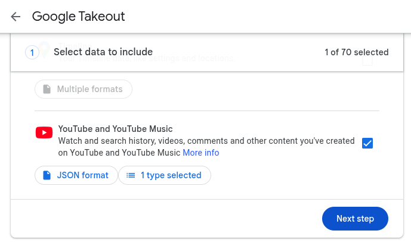
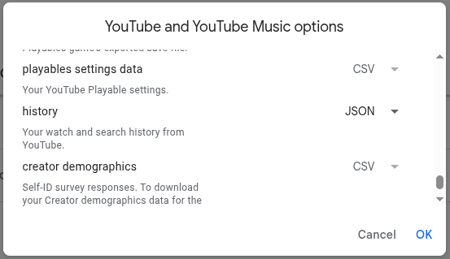
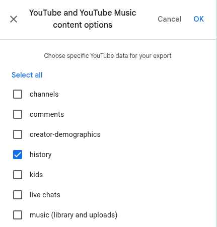
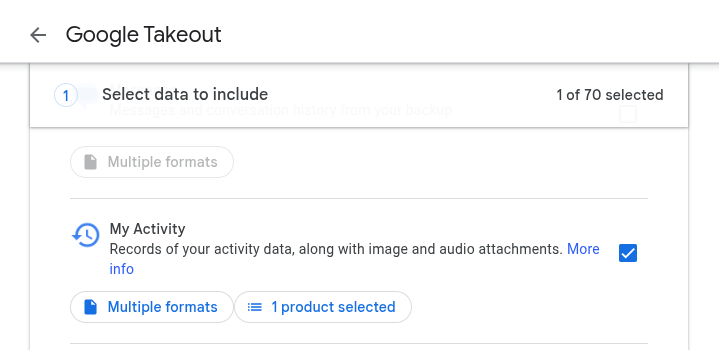
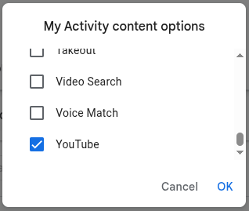
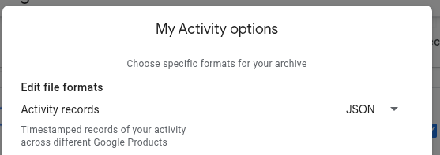

# YouTube History Analyzer

**YouTube viewing history analyzer with TUI interface**

Full-featured tool for analyzing your YouTube viewing history with data export capabilities, video duration retrieval, and interactive report generation.

> **Language versions**: [Русский](README_ru.md) | [English](README.md)

## Table of Contents

- [Key Features](#key-features)
- [Installation and Setup](#installation-and-setup)
- [Getting Data from Google Takeout](#getting-data-from-google-takeout)
- [Streamlined TUI Interface](#streamlined-tui-interface)
- [Data Structure](#data-structure)
- [Generated Reports](#generated-reports)
- [Technical Details](#technical-details)
- [Project Structure](#project-structure)
- [Usage Examples](#usage-examples)
- [Results](#results)

## Key Features

### **Smart Data Loading**
- **Automatic detection** of Takeout files
- **Combining two sources**:
  - `watch-history.json` - viewing history
  - `MyActivity.json` - YouTube activity
- **Automatic deduplication** of records
- **YouTube Music filtering** (completely excluded)

### **Video Duration Retrieval**
- **YouTube Data API v3** for reliable metadata retrieval
- **Automatic time rounding** to whole seconds
- **Progress indicators** with current statistics
- **Result caching** in CSV file

### **Analysis and Statistics**
- **Time-based activity**: hours, days of week, months
- **Top channels**
- **Watch time** with total time estimation

### **Data Export**
- **CSV file** for Excel/Google Sheets
- **Summary statistics** in JSON

### **Multilingual Support**
- **Russian and English** languages

## Installation and Setup

### Requirements
- **Python 3.8+** (including older versions)
- **Extracted Google Takeout archives**
- **YouTube Data API key** (for duration retrieval)
- **Localization files** (included in project)

### Installing Dependencies
```bash
pip3 install -r requirements.txt
```

### YouTube Data API Setup
1. Create a project in [Google Cloud Console](https://console.cloud.google.com/)
2. Enable YouTube Data API v3
3. Create an API key
4. Save the key to `youtube_api_key.txt` file in project root

Detailed instructions are described in [API_INSTRUCTIONS.md](API_INSTRUCTIONS.md)

#### **API Limitations:**
- **Quota**: 10,000 units per day
- **Request**: 1 unit per video
- **Recommendation**: start with 100-1000 video sample

## Getting Data from Google Takeout

To work with the analyzer, you need to export your YouTube viewing history from Google Takeout.

#### **Step 1: Access Google Takeout**
1. Open [Google Takeout](https://takeout.google.com/)
2. Sign in to your Google account if not authorized

#### **Step 2: Configure YouTube Export**
1. **Uncheck all services** (button "Deselect all")
2. **Check only** "YouTube and YouTube Music"
3. **Click "Next"**



#### **Step 3: Configure Data Format**
1. **File format**: select "JSON"
2. **Archive size**: leave "2 GB" (default)
3. **Click "Create export"**



#### **Step 4: Export Viewing History**
1. **Wait for** export completion
2. **Download** archive `takeout-YYYYMMDDTHHMMSSZ-001.zip`
3. **Extract** to `Takeout/` folder in project root



#### **Step 5: Export My Activity (Optional)**
To get data before 2021, additionally export My Activity:

1. **Return** to Google Takeout
2. **Check** "My Activity"
3. **Click "Next"**



4. **Select only YouTube** from service list
5. **Format**: JSON
6. **Create export** and download second archive



7. **Extract** second archive to same `Takeout/` folder



#### **Export Result**
After extraction, you should have structure:
```
Takeout/
├── YouTube and YouTube Music/
│   └── history/
│       └── watch-history.json
└── My Activity/
    └── YouTube/
        └── MyActivity.json
```

### Launch
```bash
python3 youtube_analyzer.py
```

## Streamlined TUI Interface

The analyzer provides a convenient text interface with automation of main operations:

```
╭───────────────────────────────────────╮
│ YouTube History Analyzer              │
│ YouTube Viewing History Analyzer      │
╰───────────────────────────────────────╯

📊 Main Statistics
┌─────────────┬─────────┐
│ Parameter   │ Value   │
├─────────────┼─────────┤
│ Total Videos│ 1,234  │
│ Active Days │ 456     │
│ Average     │ 2.7     │
│ Videos/Day  │         │
└─────────────┴─────────┘

🏆 Top Channels
┌─────────────┬──────┐
│ Channel     │ Videos│
├─────────────┼──────┤
│ Channel 1   │ 123  │
│ Channel 2   │ 89   │
│ Channel 3   │ 67   │
└─────────────┴──────┘

📊 Main Menu
1. Load data from Takeout
2. Get video duration
3. Generate HTML report
4. Export data to CSV
5. Open report in browser
0. Exit
```

### **Option 1: Load Data from Takeout**
- **Automatically finds** and loads both sources
- **Combines data** without duplicates
- **Applies YouTube Music filtering**
- **Shows statistics** of combination in real time

### **Option 2: Get Video Duration**
- **YouTube Data API v3** for reliability
- **Configurable sample size** (default 100)
- **Progress indicators** with current statistics:
  - Current average time
  - Number of processed videos
  - Completion percentage
- **Automatic saving** to CSV

### **Option 3: Generate HTML Report**
- **Automatically creates graphs** during generation
- **Built-in statistics** and top channels
- **Duration statistics** (if available)
- **Total watch time** with estimates
- **Interactive Plotly graphs**

### **Option 4: Export Data to CSV**
- **Data in convenient format** for Excel/Google Sheets
- **Additional fields** for analysis
- **Video duration** in seconds and readable format
- **Automatic creation** of README with column descriptions

### **Option 5: Open Report in Browser**
- **View HTML report** with graphs
- **Automatic opening** in default browser

## Data Structure

### **Main CSV Fields:**
- **video_id**: unique video identifier
- **title**: video title
- **channel**: channel name
- **url**: video link
- **date**: viewing date
- **time**: viewing time
- **day_of_week**: day of week
- **source**: data source
- **duration_seconds**: video duration in seconds
- **duration_formatted**: human-readable duration

## Generated Reports

### **HTML Report with Graphs**
- **Monthly activity** trends
- **Cumulative watch time** over time
- **Day of week activity** patterns
- **Hourly activity** distribution
- **Top channels** with statistics
- **Duration statistics** (if available)

### **Interactive Charts**
- **Plotly-based** interactive graphs
- **Zoom and pan** capabilities
- **Hover information** with details
- **Export to PNG** functionality

### **Statistics Dashboard**
- **Main metrics** in visual cards
- **Channel rankings** with counts
- **Time analysis** with estimates
- **Data coverage** information

### **Additional Information**
- **Analysis period** with dates
- **Data sources** with record counts
- **Filtering** and deduplication

## Technical Details

### **Data Processing:**
- **Deduplication**: by `video_id` + `timestamp`
- **Filtering**: by `header` and `titleUrl`
- **Validation**: required field checking

### **Duration Retrieval:**
- **YouTube Data API v3** for reliability
- **ISO 8601 parsing** of duration (PT3M7S → 187 seconds)
- **API error handling** (400, 403, timeouts)
- **Result caching** in CSV

### **Compatibility:**
- **Python 3.8+** (including older versions)
- **Cross-platform** (Linux, Windows, macOS)
- **Auto-detection** of file encodings

## Project Structure

```
youtube-history-analytics/
├── youtube_analyzer.py          # Main script
├── requirements.txt             # Python dependencies
├── README.md                   # Documentation
├── locales.py                  # Localization files
├── youtube_api_key.txt         # YouTube Data API key
├── images/                     # Screenshots and images
├── Takeout/                    # Extracted archives
│   ├── YouTube and YouTube Music/
│   └── My Activity/
└── youtube_analysis_output/    # Analysis results
    ├── report.html             # HTML report
    ├── youtube_history_export.csv  # CSV export
    ├── youtube_history_summary.json # Statistics
    ├── video_durations.csv     # Video durations
    └── README_export.md        # Export description
```

## Usage Examples

### **Quick Start**
```bash
# 1. Install dependencies
pip3 install -r requirements.txt

# 2. Setup API key
echo "YOUR_API_KEY_HERE" > youtube_api_key.txt

# 3. Launch analyzer
python3 youtube_analyzer.py

# 4. Select language (Russian/English)
# 5. Load data from Takeout
# 6. Get video duration
# 7. Generate HTML report
```

### **Typical Analysis Process**
1. **Load data** → automatic combination of two sources
2. **Get duration** → sample 100-1000 videos to start
3. **Generate report** → create interactive graphs
4. **Export CSV** → data for Excel/Google Sheets
5. **View results** → analyze viewing habits

### **Result Analysis**
- **Peak hours**: when you most often watch YouTube
- **Favorite days**: which days of week have higher activity
- **Trends**: how activity changes by months
- **Top channels**: your favorite content creators
- **Watch time**: total time spent on YouTube

## Results

After analysis, you will have:

1. **HTML report** with interactive graphs
2. **CSV file** for further analysis
3. **Viewing statistics**
4. **Clean data** without duplicates and music
5. **Video duration** for accurate time calculation
6. **Understanding** of your viewing habits

---

**Analyze your YouTube history with pleasure and accurate time data!**
