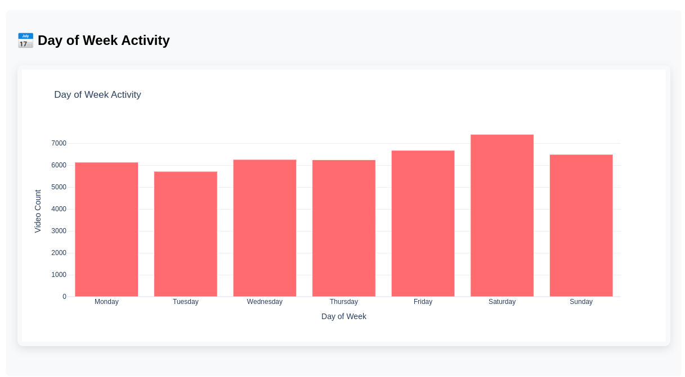
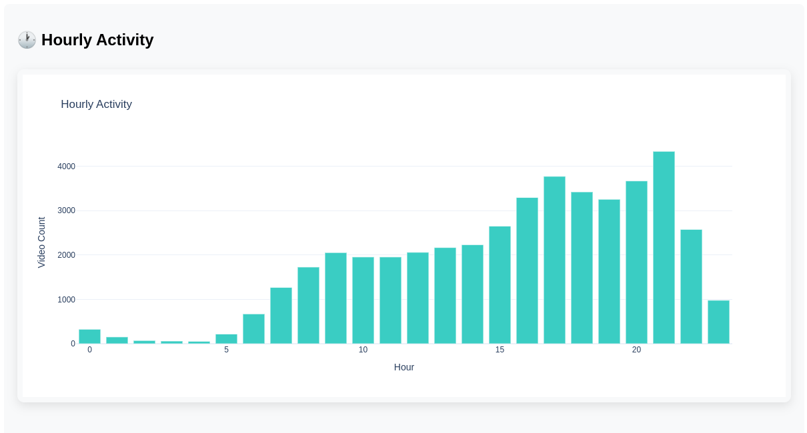
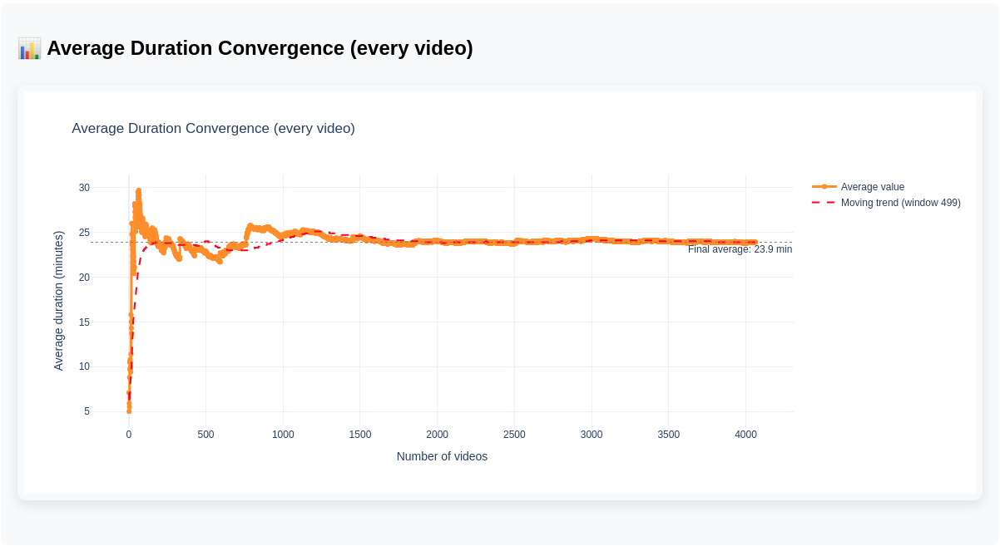
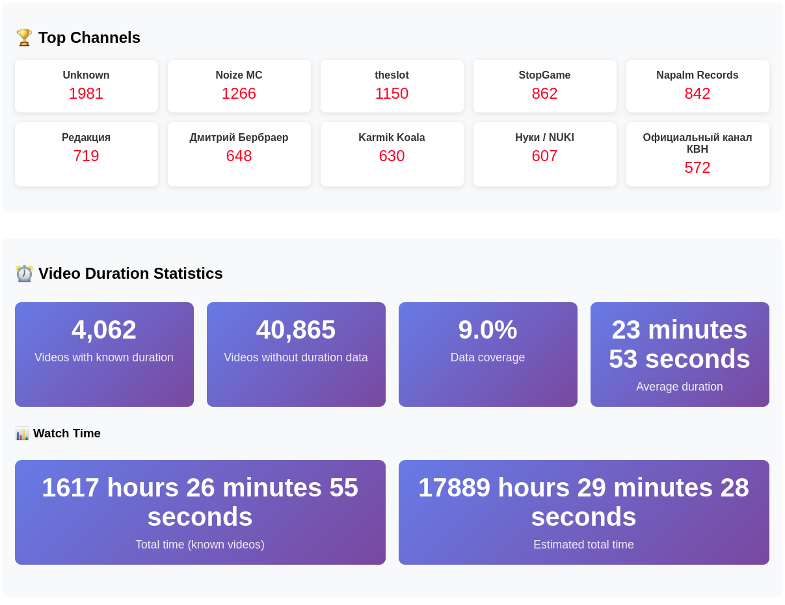
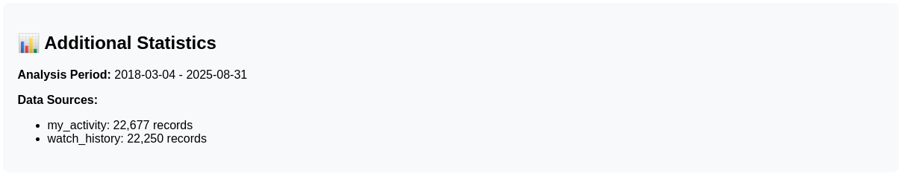

# YouTube History Analyzer

**Анализатор истории просмотров YouTube с TUI интерфейсом**

Полнофункциональный инструмент для анализа вашей истории просмотров YouTube с возможностью экспорта данных, получения длительности видео и создания интерактивных отчетов.

> **Версии на языках**: [Русский](README_ru.md) | [English](README.md)

## Оглавление

- [Основные возможности](#основные-возможности)
- [Установка и запуск](#установка-и-запуск)
- [Получение данных из Google Takeout](#получение-данных-из-google-takeout)
- [Упрощенный TUI интерфейс](#упрощенный-tui-интерфейс)
- [Структура данных](#структура-данных)
- [Генерируемые отчеты](#генерируемые-отчеты)
- [Технические детали](#технические-детали)
- [Структура проекта](#структура-проекта)
- [Примеры использования](#примеры-использования)
- [Результат](#результат)

## Основные возможности

### **Умная загрузка данных**
- **Автоматическое обнаружение** файлов Takeout
- **Объединение двух источников**:
  - `watch-history.json` - история просмотров
  - `MyActivity.json` - активность YouTube
- **Автоматическая дедупликация** записей
- **Фильтрация YouTube Music** (полностью исключен)

### **Получение длительности видео**
- **YouTube Data API v3** для надежного получения метаданных
- **Автоматическое округление** времени до целых секунд
- **Прогресс-индикаторы** с текущей статистикой
- **Кэширование результатов** в CSV файл

### **Анализ и статистика**
- **Активность по времени**: часы, дни недели, месяцы
- **Топ каналы**
- **Время просмотра** с оценкой общего времени

### **Экспорт данных**
- **CSV файл** для Excel/Google Sheets
- **Сводная статистика** в JSON

### **Многоязычность**
- **Русский и английский** языки

## Установка и запуск

### Требования
- **Python 3.8+** (включая старые версии)
- **Распакованные архивы** Google Takeout
- **YouTube Data API ключ** (для получения длительности)
- **Файлы локализации** (включены в проект)

### Установка зависимостей
```bash
pip3 install -r requirements.txt
```

### Настройка YouTube Data API
1. Создайте проект в [Google Cloud Console](https://console.cloud.google.com/)
2. Включите YouTube Data API v3
3. Создайте API ключ
4. Сохраните ключ в файл `youtube_api_key.txt` в корне проекта

Детальные инструкции описаны в [API_INSTRUCTIONS.md](API_INSTRUCTIONS_ru.md)

#### **Ограничения API:**
- **Квота**: 10,000 единиц в день
- **Запрос**: 1 единица на видео
- **Рекомендация**: начинайте с выборки 100-1000 видео

## Получение данных из Google Takeout

Для работы с анализатором необходимо выгрузить вашу историю просмотров YouTube из Google Takeout.

#### **Шаг 1: Переход в Google Takeout**
1. Откройте [Google Takeout](https://takeout.google.com/)
2. Войдите в аккаунт Google, если не авторизованы

#### **Шаг 2: Настройка выгрузки YouTube**
1. **Снимите галочки** со всех сервисов (кнопка "Отменить выбор")
2. **Поставьте галочку** только на "YouTube и YouTube Music"
3. **Нажмите "Далее"**


#### **Шаг 3: Настройка формата данных**
1. **Формат файла**: выберите "JSON"
2. **Размер архива**: оставьте "2 ГБ" (по умолчанию)
3. **Нажмите "Создать экспорт"**


#### **Шаг 4: Выгрузка истории просмотров**
1. **Дождитесь** завершения экспорта
2. **Скачайте** архив `takeout-YYYYMMDDTHHMMSSZ-001.zip`
3. **Распакуйте** в папку `Takeout/` в корне проекта


#### **Шаг 5: Выгрузка My Activity (опционально)**
Для получения данных до 2021 года дополнительно выгрузите My Activity:

1. **Вернитесь** в Google Takeout
2. **Поставьте галочку** на "Мои действия"
3. **Нажмите "Далее"**


4. **Выберите только YouTube** из списка сервисов
5. **Формат**: JSON
6. **Создайте экспорт** и скачайте второй архив


7. **Распакуйте** второй архив в ту же папку `Takeout/`


#### **Результат выгрузки**
После распаковки у вас должна быть структура:
```
Takeout/
├── YouTube and YouTube Music/
│   └── history/
│       └── watch-history.json
└── My Activity/
    └── YouTube/
        └── MyActivity.json
```

### Запуск
```bash
python3 youtube_analyzer.py
```

## Упрощенный TUI интерфейс

Анализатор предоставляет удобный текстовый интерфейс с автоматизацией основных операций:

```
╭───────────────────────────────────────╮
│ YouTube History Analyzer              │
│ Анализатор истории просмотров YouTube │
╰───────────────────────────────────────╯

📊 Основная статистика
┌─────────────┬─────────┐
│ Параметр    │ Значение│
├─────────────┼─────────┤
│ Всего видео │ 1,234  │
│ Дней активности│ 456   │
│ Среднее видео│ 2.7    │
│ в день      │         │
└─────────────┴─────────┘

🏆 Топ каналов
┌─────────────┬──────┐
│ Канал       │ Видео│
├─────────────┼──────┤
│ Channel 1   │ 123  │
│ Channel 2   │ 89   │
│ Channel 3   │ 67   │
└─────────────┴──────┘

📊 Главное меню
1. Загрузить данные из Takeout
2. Получить длительность видео
3. Сгенерировать HTML отчет
4. Экспорт данных в CSV
5. Открыть отчет в браузере
0. Выход
```

### **Пункт 1: Загрузить данные из Takeout**
- **Автоматически находит** и загружает оба источника
- **Объединяет данные** без дублей
- **Применяет фильтрацию** YouTube Music
- **Показывает статистику** объединения в реальном времени

### **Пункт 2: Получить длительность видео**
- **YouTube Data API v3** для надежности
- **Настраиваемый размер выборки** (по умолчанию 100)
- **Прогресс-индикаторы** с текущей статистикой:
  - Текущее среднее время
  - Количество обработанных видео
  - Процент выполнения
- **Автоматическое сохранение** в CSV

### **Пункт 3: Сгенерировать HTML отчет**
- **Автоматически создает графики** при генерации
- **Встроенная статистика** и топ каналы
- **Статистика по длительности** (если доступна)
- **Общее время просмотра** с оценками
- **Интерактивные графики** Plotly

### **Пункт 4: Экспорт данных в CSV**
- **Данные в удобном формате** для Excel/Google Sheets
- **Дополнительные поля** для анализа
- **Длительность видео** в секундах и читаемом формате
- **Автоматическое создание** README с описанием колонок

### **Пункт 5: Открыть отчет в браузере**
- **Просмотр HTML отчета** с графиками
- **Автоматическое открытие** в браузере по умолчанию

## Структура данных

### **Основные поля CSV:**
- **video_id**: уникальный идентификатор видео
- **title**: название видео
- **channel**: название канала
- **url**: ссылка на видео
- **date**: дата просмотра
- **time**: время просмотра
- **day_of_week**: день недели
- **source**: источник данных
- **duration_seconds**: длительность в секундах
- **duration_formatted**: читаемый формат длительности

## Генерируемые отчеты

### **HTML отчет с графиками**
- **Активность по месяцам** - тренды
- **Накопительное время просмотра** по времени
- **Активность по дням недели** - паттерны
- **Распределение по часам** - активность
- **Топ каналы** со статистикой
- **Статистика по длительности** (если доступна)

### **Интерактивные графики**
- **Основанные на Plotly** интерактивные графики
- **Возможности масштабирования** и перемещения
- **Информация при наведении** с деталями
- **Экспорт в PNG** функциональность
- **График сходимости среднего** длительности видео

### **Панель статистики**
- **Основные метрики** в визуальных карточках
- **Рейтинги каналов** с количеством
- **Анализ времени** с оценками
- **Информация о покрытии** данных

### **Дополнительная информация**
- **Период анализа** с датами
- **Источники данных** с количеством записей
- **Фильтрация** и дедупликация

## Технические детали

### **Обработка данных:**
- **Дедупликация**: по `video_id` + `timestamp`
- **Фильтрация**: по `header` и `titleUrl`
- **Валидация**: проверка обязательных полей

### **Получение длительности:**
- **YouTube Data API v3** для надежности
- **ISO 8601 парсинг** длительности (PT3M7S → 187 секунд)
- **Обработка ошибок** API (400, 403, таймауты)
- **Кэширование** результатов в CSV

### **Совместимость:**
- **Python 3.8+** (включая старые версии)
- **Кроссплатформенность** (Linux, Windows, macOS)
- **Автоопределение** кодировок файлов

## Структура проекта

```
youtube-history-analytics/
├── youtube_analyzer.py          # Основной скрипт
├── requirements.txt             # Зависимости Python
├── README.md                   # Документация
├── locales.py                  # Файлы локализации
├── youtube_api_key.txt         # YouTube Data API ключ
├── images/                     # Скриншоты и изображения
├── Takeout/                    # Распакованные архивы
│   ├── YouTube and YouTube Music/
│   └── My Activity/
└── youtube_analysis_output/    # Результаты анализа
    ├── report.html             # HTML отчет
    ├── youtube_history_export.csv  # CSV экспорт
    ├── youtube_history_summary.json # Статистика
    ├── video_durations.csv     # Длительности видео
    ├── average_convergence.html # График сходимости среднего
    ├── average_progression.csv # Данные о прогрессии среднего
    ├── average_progression.json # JSON с данными о среднем
    └── README_export.md        # Описание экспорта
```

## Примеры использования

### **Быстрый старт**
```bash
# 1. Установка зависимостей
pip3 install -r requirements.txt

# 2. Настройка API ключа
echo "YOUR_API_KEY_HERE" > youtube_api_key.txt

# 3. Запуск анализатора
python3 youtube_analyzer.py

# 4. Выбор языка (русский/английский)
# 5. Загрузка данных из Takeout
# 6. Получение длительности видео
# 7. Генерация HTML отчета
```

### **Типичный процесс анализа**
1. **Загрузка данных** → автоматическое объединение двух источников
2. **Получение длительности** → выборка 100-1000 видео для начала
3. **Генерация отчета** → создание интерактивных графиков
4. **Экспорт CSV** → данные для Excel/Google Sheets
5. **Просмотр результатов** → анализ привычек просмотра

### **Анализ результатов**
- **Пиковые часы**: когда вы чаще всего смотрите YouTube
- **Любимые дни**: в какие дни недели активность выше
- **Тренды**: как меняется активность по месяцам
- **Топ каналы**: ваши любимые создатели контента
- **Время просмотра**: общее время, потраченное на YouTube
- **Сходимость среднего**: как стабилизируется средняя длительность видео

## Результат

После анализа у вас будет:

1. **HTML отчет** с интерактивными графиками
2. **CSV файл** для дальнейшего анализа
3. **Статистика** просмотров
4. **Очищенные данные** без дублей и музыки
5. **Длительность видео** для точного расчета времени
6. **График сходимости среднего** длительности видео
7. **Данные о прогрессии** среднего значения
8. **Понимание** ваших привычек просмотра

---

## Пример отчета

Ниже представлены скриншоты различных разделов HTML отчета, который генерирует анализатор:

[](images/report-1.png)

[](images/report-2.png)

[](images/report-3.png)

[](images/report-4.png)

[](images/report-5.png)

[](images/report-6.png)

---

**Анализируйте свою историю YouTube с удовольствием и точными данными о времени!**
